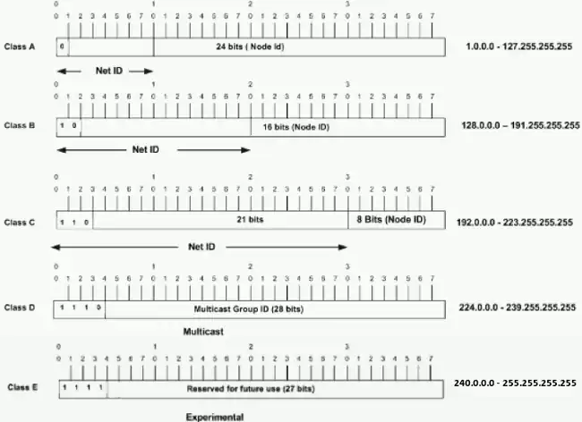
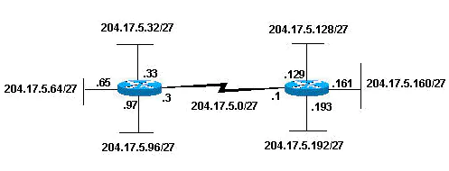

# IP Addressing and Subnetting


- Address - The unique number ID assigned to one host or interface in a network.

- Subnet - A portion of a network that shares a particular subnet address.

- Subnet mask - A 32-bit combination used to describe which portion of an address refers to the subnet and which part refers to the host.

- Interface - A network connection.

## Understand IP Addresses

An IP address is an address used in order to uniquely identify a device on an IP network. The address is made up of 32 binary bits, which can be divisible into a network portion and host portion with the help of a subnet mask. The 32 binary bits are broken into four octets (1 octet = 8 bits). Each octet is converted to decimal and separated by a period (dot). For this reason, an IP address is said to be expressed in dotted decimal format (for example, 172.16.81.100). The value in each octet ranges from 0 to 255 decimal, or 00000000 - 11111111 binary.

Here is how binary octets convert to decimal: The right most bit, or least significant bit, of an octet holds a value of 20. The bit just to the left of that holds a value of 21. This continues until the left-most bit, or most significant bit, which holds a value of 27. So if all binary bits are a one, the decimal equivalent would be 255 as shown here:
```
    1  1  1  1 1 1 1 1
  128 64 32 16 8 4 2 1 (128+64+32+16+8+4+2+1=255)
Here is a sample octet conversion when not all of the bits are set to 1.

  0  1 0 0 0 0 0 1
  0 64 0 0 0 0 0 1 (0+64+0+0+0+0+0+1=65)
And this sample shows an IP address represented in both binary and decimal.

        10.       1.      23.      19 (decimal)
  00001010.00000001.00010111.00010011 (binary)

  ```
These octets are broken down to provide an addressing scheme that can accommodate large and small networks. There are five different classes of networks, A to E

Given an IP address, its class can be determined from the three high-order bits (the three left-most bits in the first octet). Figure 1 shows the significance in the three high order bits and the range of addresses that fall into each class. For informational purposes, Class D and Class E addresses are also shown.

Figure 1


In a Class A address, the first octet is the network portion, so the Class A example in Figure 1 has a major network address of 1.0.0.0 - 127.255.255.255. Octets 2, 3, and 4 (the next 24 bits) are for the network manager to divide into subnets and hosts as he/she sees fit. Class A addresses are used for networks that have more than 65,536 hosts (actually, up to 16777214 hosts!).

In a Class B address, the first two octets are the network portion, so the Class B example in Figure 1 has a major network address of 128.0.0.0 - 191.255.255.255. Octets 3 and 4 (16 bits) are for local subnets and hosts. Class B addresses are used for networks that have between 256 and 65534 hosts.

In a Class C address, the first three octets are the network portion. The Class C example in Figure 1 has a major network address of 192.0.0.0 - 223.255.255.255. Octet 4 (8 bits) is for local subnets and hosts - perfect for networks with less than 254 hosts.

## Network Masks

A network mask helps you know which portion of the address identifies the network and which portion of the address identifies the node. Class A, B, and C networks have default masks, also known as natural masks, as shown here:
```
Class A: 255.0.0.0
Class B: 255.255.0.0
Class C: 255.255.255.0

```
An IP address on a Class A network that has not been subnetted would have an address/mask pair similar to: 8.20.15.1 255.0.0.0. In order to see how the mask helps you identify the network and node parts of the address, convert the address and mask to binary numbers.

```

8.20.15.1 = 00001000.00010100.00001111.00000001
255.0.0.0 = 11111111.00000000.00000000.00000000

```
Once you have the address and the mask represented in binary, then identification of the network and host ID is easier. Any address bits which have corresponding mask bits set to 1 represent the network ID. Any address bits that have corresponding mask bits set to 0 represent the node ID.

```
8.20.15.1 = 00001000.00010100.00001111.00000001
255.0.0.0 = 11111111.00000000.00000000.00000000
            -----------------------------------
             net id |      host id             

netid =  00001000 = 8
hostid = 00010100.00001111.00000001 = 20.15.1
```


## Understand Subnetting

Subnetting allows you to create multiple logical networks that exist within a single Class A, B, or C network. If you do not subnet, you are only able to use one network from your Class A, B, or C network, which is unrealistic.

Each data link on a network must have a unique network ID, with every node on that link being a member of the same network. If you break a major network (Class A, B, or C) into smaller subnetworks, it allows you to create a network of interconnecting subnetworks. Each data link on this network would then have a unique network/subnetwork ID. Any device, or gateway, that connects n networks/subnetworks has n distinct IP addresses, one for each network / subnetwork that it interconnects.

In order to subnet a network, extend the natural mask with some of the bits from the host ID portion of the address in order to create a subnetwork ID. For example, given a Class C network of 204.17.5.0 which has a natural mask of 255.255.255.0, you can create subnets in this manner:

```
204.17.5.0 -      11001100.00010001.00000101.00000000
255.255.255.224 - 11111111.11111111.11111111.11100000
                  --------------------------|sub|----
```
By extending the mask to be 255.255.255.224, you have taken three bits (indicated by "sub") from the original host portion of the address and used them to make subnets. With these three bits, it is possible to create eight subnets. With the remaining five host ID bits, each subnet can have up to 32 host addresses, 30 of which can actually be assigned to a device since host ids of all zeros or all ones are not allowed (it is very important to remember this). So, with this in mind, these subnets have been created.
```
204.17.5.0 255.255.255.224     host address range 1 to 30
204.17.5.32 255.255.255.224    host address range 33 to 62
204.17.5.64 255.255.255.224    host address range 65 to 94
204.17.5.96 255.255.255.224    host address range 97 to 126
204.17.5.128 255.255.255.224   host address range 129 to 158
204.17.5.160 255.255.255.224   host address range 161 to 190
204.17.5.192 255.255.255.224   host address range 193 to 222
204.17.5.224 255.255.255.224   host address range 225 to 254
```


Notice that each of the routers in Figure 2 is attached to four subnetworks, one subnetwork is common to both routers. Also, each router has an IP address for each subnetwork to which it is attached. Each subnetwork could potentially support up to 30 host addresses.

This brings up an interesting point. The more host bits you use for a subnet mask, the more subnets you have available. However, the more subnets available, the less host addresses available per subnet. For example, a Class C network of 204.17.5.0 and a mask of 255.255.255.224 (/27) allows you to have eight subnets, each with 32 host addresses (30 of which could be assigned to devices). If you use a mask of 255.255.255.240 (/28), the breakdown is:

```
204.17.5.0 -      11001100.00010001.00000101.00000000
255.255.255.240 - 11111111.11111111.11111111.11110000
                  --------------------------|sub |---
```                  
Since you now have four bits to make subnets with, you only have four bits left for host addresses. So in this case you can have up to 16 subnets, each of which can have up to 16 host addresses (14 of which can be assigned to devices).

Take a look at how a Class B network might be subnetted. If you have network 172.16.0.0, then you know that its natural mask is 255.255.0.0 or 172.16.0.0/16. Extending the mask to anything beyond 255.255.0.0 means you are subnetting. You can quickly see that you have the ability to create a lot more subnets than with the Class C network. If you use a mask of 255.255.248.0 (/21), how many subnets and hosts per subnet does this allow for?

```
172.16.0.0  -   10101100.00010000.00000000.00000000
255.255.248.0 - 11111111.11111111.11111000.00000000
                -----------------| sub |-----------
```
You use five bits from the original host bits for subnets. This allows you to have 32 subnets (25). After using the five bits for subnetting, you are left with 11 bits for host addresses. This allows each subnet so have 2048 host addresses (211), 2046 of which could be assigned to devices.

## CIDR

Classless Interdomain Routing (CIDR) was introduced in order to improve both address space utilization and routing scalability in the Internet. It was needed because of the rapid growth of the Internet and growth of the IP routing tables held in the Internet routers.

CIDR moves away from the traditional IP classes (Class A, Class B, Class C, and so on). In CIDR , an IP network is represented by a prefix, which is an IP address and some indication of the length of the mask. Length means the number of left-most contiguous mask bits that are set to one. So network 172.16.0.0 255.255.0.0 can be represented as 172.16.0.0/16. CIDR also depicts a more hierarchical Internet architecture, where each domain takes its IP addresses from a higher level. This allows for the summarization of the domains to be done at the higher level. For example, if an ISP owns network 172.16.0.0/16, then the ISP can offer 172.16.1.0/24, 172.16.2.0/24, and so on to customers. Yet, when advertising to other providers, the ISP only needs to advertise 172.16.0.0/16.